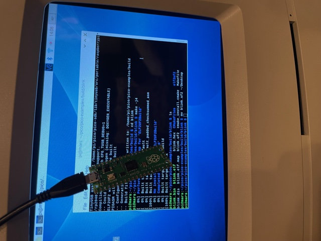
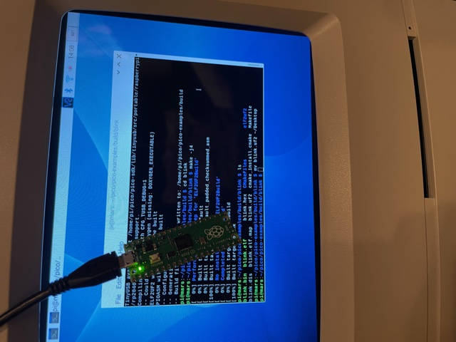

# Getting started

Turns out most of the guides that exist assuming you're going to be using a Raspberry Pi to program the Pico (well, that isn't surprising - but see the end of this page!) so I'm going to start by connecting my Pico to a Raspberry Pi 4 that I have set-up and ready for Linux-y things. Once I get it working here, it would be interesting to see if it ran on Windows under WSL (or Mac, using Brew).

I like to use my Mac still, so I use VNC to log into the Pi's desktop, and VSCode to log into the Pi's terminal / edit files. It's a convenient system as my workbench for the electronics stuff is different from my Mac desk.

## Installing the Pico SDK on a Raspberry Pi

This process will take a while (> 1 hour ?) and it will also require 2.5Gb of disk space (which is a lot on a typically small SDCard-based Pi installation). Check you have enough before you start:

```
df -Bm 
```

Getting tight? This page will be useful: [Freeing up space on your Raspberry Pi](https://www.raspberrypi-spy.co.uk/2018/03/free-space-raspberry-pi-sd-card/).

```
wget https://raw.githubusercontent.com/raspberrypi/pico-setup/master/pico_setup.sh 

chmod +x pico_setup.sh

./pico_setup.sh
```

Kick off the install. Time passes..  


Note: This installs Microsoft's Visual Studio Code editor as part of the set-up process. Some people don't like that. I think it's the best editor on the Pi, but your millage may vary. Some extensions are included that will make your life easier.

## Once the tools are installed..

Reboot.

```sudo reboot```


## Get the sample code

[The instructions](https://datasheets.raspberrypi.org/pico/getting-started-with-pico.pdf) say to clone the two sample GitHub repos for [SDK](https://github.com/raspberrypi/pico-sdk.git) and [Examples](https://github.com/raspberrypi/pico-examples.git), but I found the set-up script did this already.

Likewise, the remaining tools were installed and set up already, so I could skip a few steps. If you find the next part doesn't work for you, consult the instructions and install the missing parts.

## Finally, write some code!

```
cd pico-examples
cd build
cmake ..
```

This preps all the examples. Let's build the one called BLINK:

```
cd blink
make -j4
```

I have no idea what '-j4' does, but at the end of this it says 

```
[100%] Built target blink
```

so I am prepared to believe it. The file ```blink.uf``` is the important one: we can drag it directly into the Pico. The Pico's trick of appearing as a USB device means that you can just drag-and-drop the .uf file and the Pico will unmount itself, and reboot - launching the program once it restarts. It's very cool, and that's exactly what happened. 

To simulate what I see, switch your gaze from one image to the other:

 

BLINK looks like this:

```
#include "pico/stdlib.h"

int main() {
    const uint LED_PIN = 25;
    gpio_init(LED_PIN);
    gpio_set_dir(LED_PIN, GPIO_OUT);
    while (true) {
        gpio_put(LED_PIN, 1);
        sleep_ms(250);
        gpio_put(LED_PIN, 0);
        sleep_ms(250);
    }
}
```

Ok, so it's C rather than Assembler, but it proves the toolchain is working.

If you unplug the Pico and plug it back in, it will immediately launch the BLINK program again. Instead, hold down the little button on it while you plug in - and it will come back as a USB device.

The Instructions list some command line magic to unmount and remount the Pico so you can do it all under software control.

I have to admit that this is a really nice C development device. The Instructions carry on to demonstrate setting up a Serial port (using the USB port or hardware pins on the Pico itself). There's also a good debugging options, so you can monitor the C program as it runs. 

So far, the C makes it rather like an Arduino - but I don't know if it has the same level of libary support for the billions of devices the Arduino has. The lack of integral WiFi make it a little less useful that some devices, but it should be easy to add some via an ESP for example. I guess the Pico's strenghts are low power, high performance.

## Developing on the Mac and PC

Well! If I had just kept reading the [Instructions](https://datasheets.raspberrypi.org/pico/getting-started-with-pico.pdf), I would have seen that there are guides for installing on Mac, using Brew. There's also a Windows version of the environment (but it doesn't use WSL). That would have saved me an hour of installation time.. that said the Mac instructions did not work for me (yet).

## Wait.. is this C or Assembler?

Yeah, turns out this is for C. I wonder how to do assembly language? Hmm.


