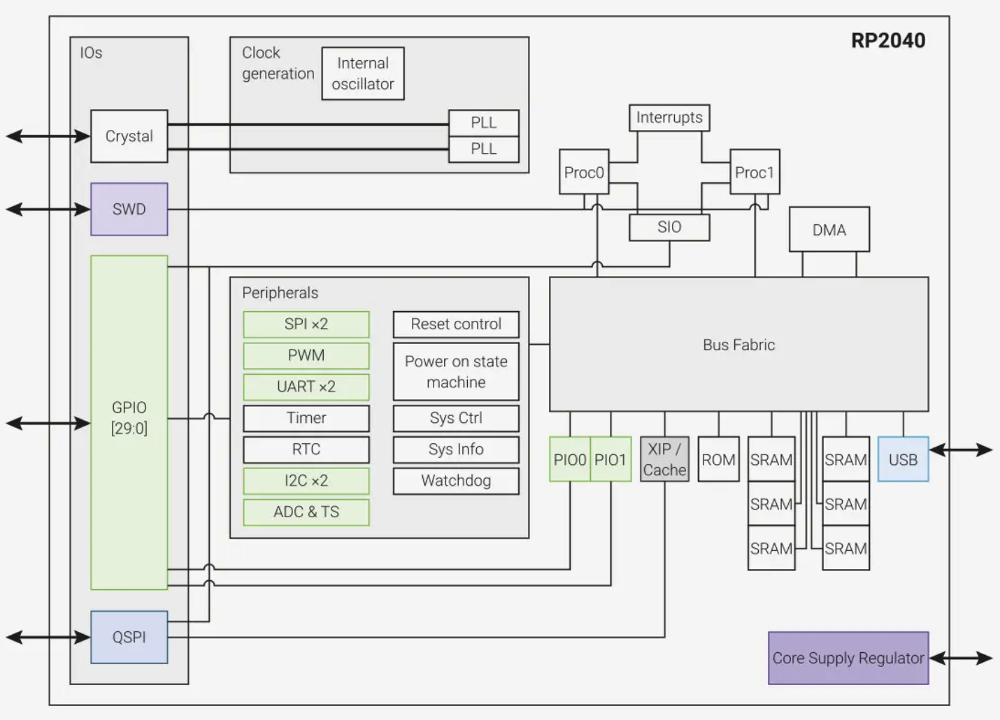

# The Pico is Weird

While searching for writing ARM on Pico guides, I found something.

You need to see this - [A closer look at Raspberry Pi RP2040 Programmable IOs (PIO)](https://www.cnx-software.com/2021/01/27/a-closer-look-at-raspberry-pi-rp2040-programmable-ios-pio/) - because clearly the Pico is not just a little Raspberry Pi.

It's powered by something called a [RP2040 microcontroller](https://www.cnx-software.com/2021/01/21/raspberry-pi-pico-board-features-rp2040-dual-core-cortex-m0-mcu/#raspberry-pi-rp2040-microcontroller).

The PIOs seem to be "programmable I/O" systems that have their own assembly langauge (with only nine instructions) that can do crazy stuff like accessing SD cards or generating VGA video.

This is getting crazy.. I don't know if the Pico supports the same Raspberry Pi ARM programming, or if the MicroPython and C environments are better. 

It seems like a good approach is to use MicroPython or C, and within these environments, if required, the low-level PIO stuff can be done. So you could write a CPU emulation in MicroPython, and then use the PIO stuff to generate VGA. 

(Yeah, if you like a retrocomputer system with built-in VGA output, this is ideal.)

I cannot find any examples of Pico running ARM sample code at this time.
